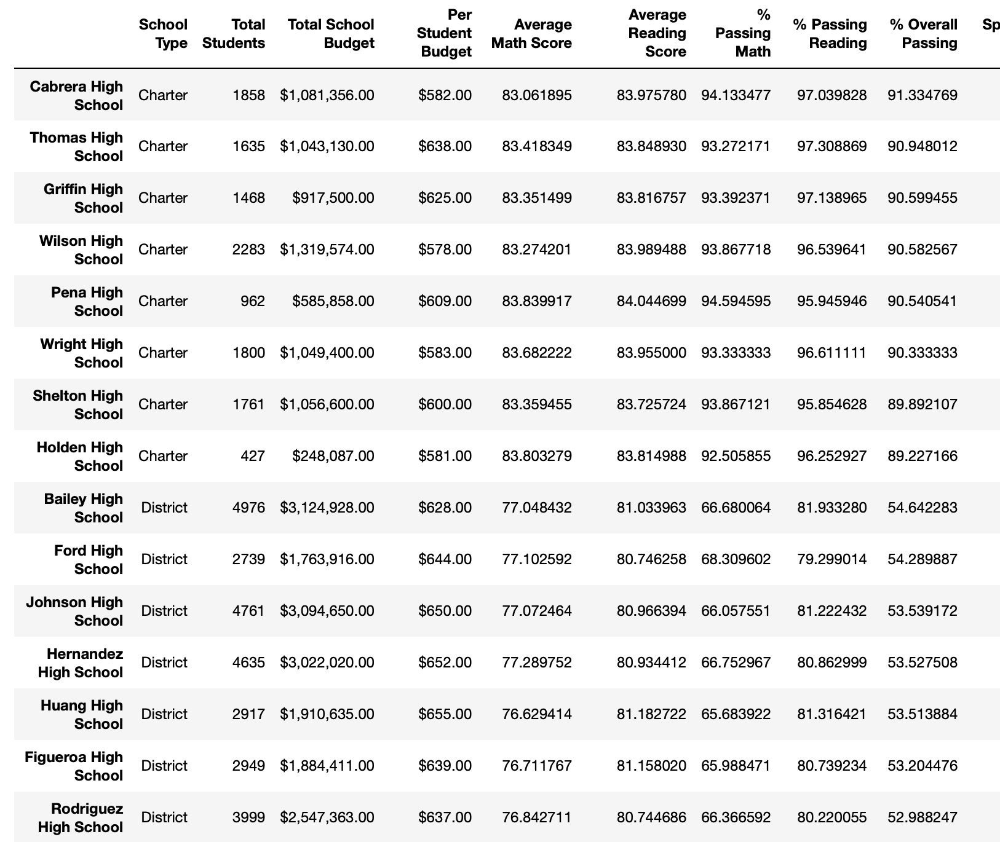
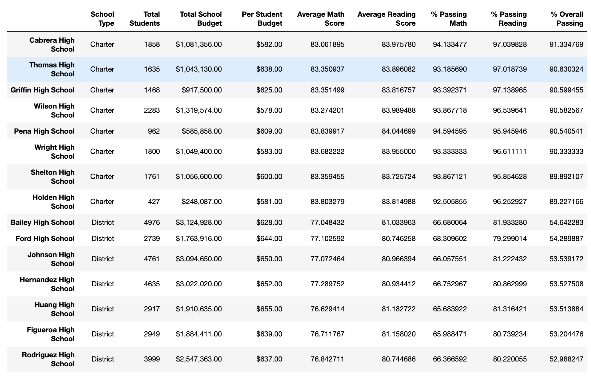
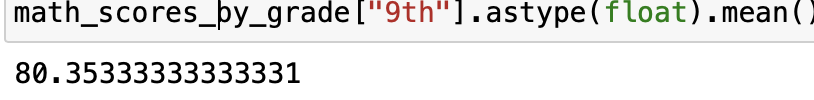
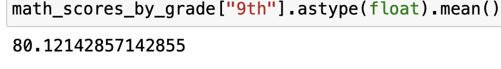
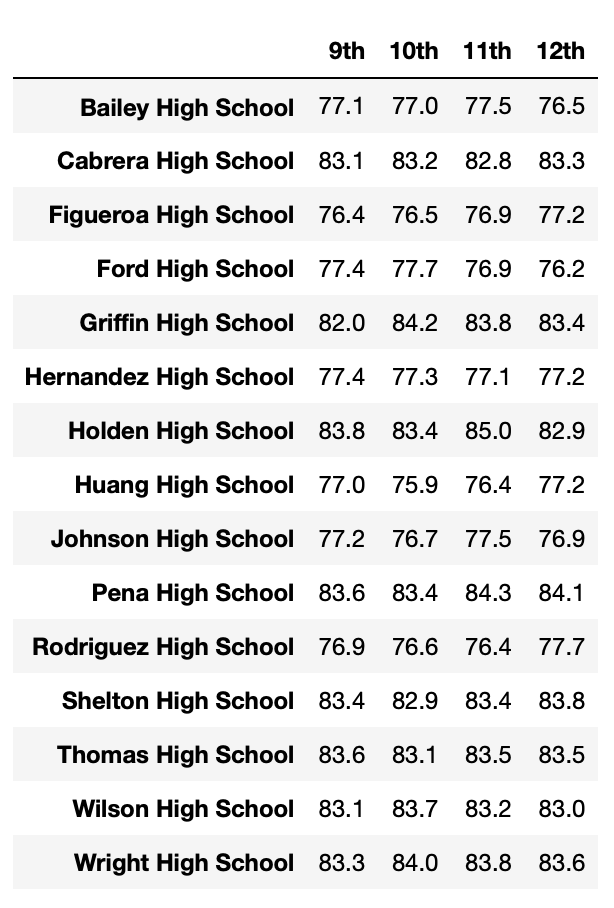
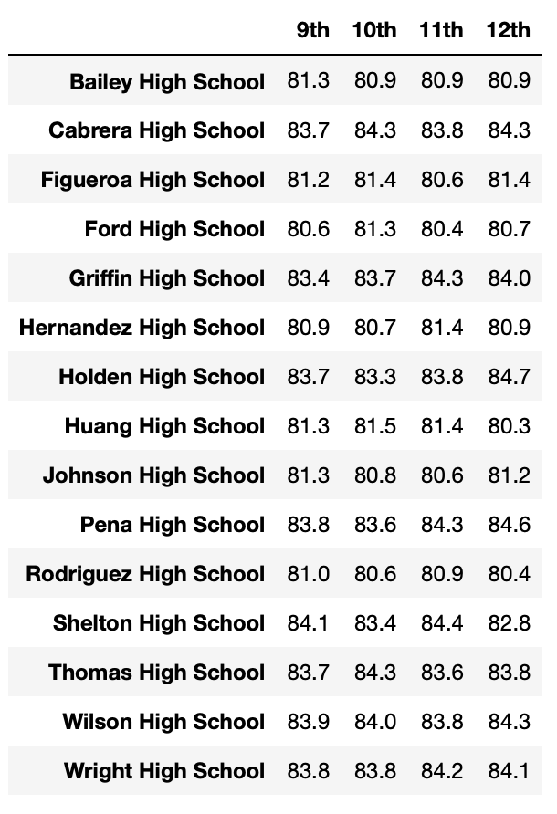

# Py_City_Schools

## Overview

In order to investigate potential academic dishonesty, a school board dataset's math and reading scores are compared before and after the exclusion of a specific subset of students (9th grade Thomas High School students).

## Results

### District Summary

Scores after removing Thomas High School 9th grader's grades.

    * The percentage of students passing math and reading each decreased by 1.1 percentage points for the whole district
    * The total population included the ninth graders (but not their scores)
      * Math:
        * Original: 75.9; Adjusted: 74.8
      * Reading:
        * Original: 86.8; Adjusted 85.7
        
### School summary:

     * Thomas High School's performance only slightly decreased after removing the ninth graders's scores
        * Math:
        * Original: 93.3; Adjusted: 93.2
      * Reading:
        * Original: 97.3; Adjusted 97.0

### Relative Performance

       * Thomas High School remained in second position in overall passing percentage
       
#### Summary before and after removal of Thomas High School Ninth Graders

### Grade

Replacing ninth graders:

    * the mean of the district ninth graders math scores decreased by 0.3% (80.4 to 80.12)
    * the mean of the district ninth graders reading scores decreased by 0.1% (82.5 to 82.4)
 
#### Mean math score before and after removal of Thomas High School Ninth Graders
 
 
 
 
    
### Spending

    * The values for school spending outcomes were relatively unchanged 

### Size

    * The values for the Thomas High School size interval were unchanged 
    
### Type

    * The values for charter schools were unchanged 
   

## Summary

  * After the Thomas High School ninth graders scores were replaced with nans, most district wide metrics remained unchanged when they were subtracted from the total number of students. When ninth graders scores were removed entirely without subtracting the students from the student total, the percentage of passing students only decreased by 1.1%.

  * Other Thomas High School students had similarly high scores (i.e. Thomas High School reading scores: 9th: 83.7, 10th: 84.3, 11th: 83.6, 12th: 83.8). The mean district-wide grades of ninth graders decreased slightly (0.3% in math and 0.1% in reading). Thomas High School's performance slightly decreased after removing the ninth grader's scores. 

